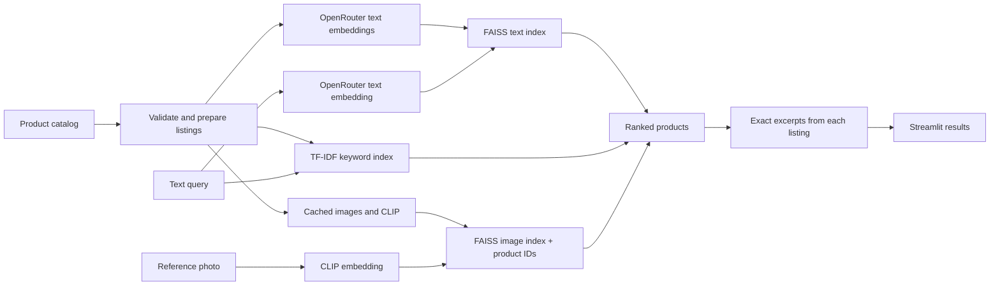

# Semantic Product Search

Find fashion products using a description or a reference photo. A local search application built by Taiwu Chen with Streamlit, OpenAI text embeddings through OpenRouter, CLIP, and FAISS.

The project explores a concrete question: can shoppers find an item without knowing the exact words used in its listing? It searches 66 archival ZARA menswear products and lets you compare keyword retrieval with semantic retrieval and keyword boosting.

## What you can try

- Describe a garment: **“a coat with a removable inner layer.”**
- Search with a paraphrase: **“a short jean jacket.”**
- Upload a reference photo to retrieve visually similar products.
- Open **Search options** to compare Semantic, Semantic + keywords, and Keyword retrieval.
- Expand **View details** to inspect exact listing excerpts for each result. These are source evidence, not generated product claims.

This is catalog search, not a personalized recommendation system. It has no user profiles, purchase history, or inventory integration.

## Run locally

Use `uv` and Python 3.12. No deployment is required. On macOS, install uv with `brew install uv` if needed.

```bash
uv venv --python 3.12 .venv
uv pip sync requirements.lock
source .venv/bin/activate
streamlit run src/app/streamlit_app.py
```

For an existing `.venv`, skip the creation step. Use `uv pip sync requirements.lock` to install dependencies; `pip` is not bundled with uv-created environments.

The catalog and keyword method work without cloud credentials. Image search downloads the CLIP model on first use and runs inference locally. Product images are downloaded from their catalog URLs and cached locally.

For semantic search, copy `.env.example` to `.env` and set your OpenRouter API key:

```bash
cp .env.example .env
```

```dotenv
OPENROUTER_API_KEY=your_key_here
```

Semantic search sends listing text and search queries to OpenRouter and the serving provider. It requires internet access and an OpenRouter account with embedding access and sufficient credits. Google Cloud credentials are not needed. No text-generation service is used.

## How it works



Text search uses `openai/text-embedding-3-small` through OpenRouter with 1,536-dimensional vectors. Queries and documents use the same embedding method. API responses are reordered by their input indices and checked for missing rows, duplicates, invalid dimensions, and nonfinite or zero vectors before indexing. Image search uses `openai/clip-vit-base-patch32`. The two embedding spaces have separate indexes; this app does not combine a text query and photo into a joint query.

FAISS performs exact squared Euclidean search. At 66 products, approximate search and a hosted vector database would add complexity without a demonstrated need. CLIP embeddings are normalized. Retrieval scores are not displayed as confidence percentages.

Keyword search uses TF-IDF cosine similarity with English stop words removed. The boosted method retains the original heuristic: retrieve up to 15 semantic candidates, rescale their distances relative to the largest candidate distance, and multiply by `1 + 0.5 × matching query terms`. Terms longer than two characters use substring matching. This is an experimental reranker, not a learned relevance model; it can reward incidental matches and needs evaluation.

## Reliability decisions

- Indexes are built once per catalog/model/preprocessing fingerprint and loaded on later runs. Text and image preparation are independent and happen on demand.
- A completed index is published from a temporary directory, so a failed build does not leave a half-written index at the final path.
- Every image vector carries the original product ID. A missing image cannot shift subsequent vectors onto different products.
- Missing images are excluded from image search; searchable coverage is shown in the app. Text search still includes those products.
- Empty indexes return no results. Small catalogs return only real products. Invalid vectors and mismatched metadata fail explicitly.
- CPU image inference uses one PyTorch thread to keep cached models stable across Streamlit worker threads on the tested Mac.
- Search results remain in session state when an example or another control triggers a rerun.
- Explanations quote the selected listing. They do not infer a zip closure from zipped pockets or borrow material claims from neighboring products.

Downloaded images are cached under `indexes/images`. Failed downloads are recorded in each image index's `build.json`. To retry unavailable images, delete only that image index directory while the app is stopped, then run image search again. Catalog and model changes automatically create a new index; there is no old-index migration path.

## Evaluation

The [24-query set](evaluation/queries.json) contains material, shape, detail, and paraphrase queries, with relevant product links and written rationales. Labels were authored by the coding assistant from the catalog before retrieving results. **They are provisional and have not been independently reviewed.**

Run the three methods on the same queries:

```bash
python -m evaluation.run
```

Run only the credential-free baseline:

```bash
python -m evaluation.run --modes keyword --output evaluation/keyword-results
```

The runner writes JSON with every ranked result and Markdown with P@5, Recall@5, nDCG@5, MRR@5, median latency, p95 latency, and the lowest-ranked cases. It checks the catalog hash so labels cannot silently outlive their dataset. Search timing includes query embedding and retrieval, excluding initial setup, downloads, and rendering. Semantic methods share one query embedding per query for a fair comparison.

The [live comparison](evaluation/results.md) measured all three methods on the same 24 queries:

| Method | nDCG@5 | Recall@5 | Median search time |
|---|---:|---:|---:|
| Keyword | 0.773 | 0.847 | 0.8 ms |
| Semantic | 0.900 | 0.964 | 432 ms |
| Semantic + keywords | 0.892 | 0.978 | 432 ms |

Semantic search is the default. It ranked results best on this provisional set; keyword boosting slightly increased recall but reduced ranking quality. Timings come from one local run, including the embedding API call for semantic methods.

Precision at five is capped below 1 when the catalog has fewer than five relevant products. Recall and nDCG make those cases easier to interpret. This small diagnostic set does not establish generalization, personalized recommendation quality, image-search relevance, or production latency.

## Verify

```bash
python -m unittest discover -s tests -v
```

See the [verification record](evaluation/validation.md) for earlier checks; the live comparison above completes the previously pending OpenRouter evaluation. For a live CLIP check across successive worker threads, run `python -m evaluation.image_smoke`.

Regression checks cover failed image downloads and ID alignment after saving/reloading, index reuse, invalid vectors, small and empty catalogs, source-grounded excerpts, and evaluation metrics.

## Project layout

```text
src/app/                 Streamlit presentation and styling
src/models/              Text/image embedding clients and FAISS storage
src/search/              Index preparation, keyword retrieval, listing evidence
src/utils/               Catalog validation and cached image loading
evaluation/              Queries, metrics runner, measured reports
tests/                   Retrieval and persistence regression checks
```

## Scope and limitations

- The dataset contains only 66 archival menswear listings. Some original image and product URLs no longer work; prices and availability are not tracked.
- Text retrieval reflects what the listing says. It does not guarantee every constraint, distinguish all negations, or validate missing attributes.
- Image similarity can reflect backgrounds and poses as well as garments. It cannot confirm materials from a photo.
- The initial model download and image indexing are slower than subsequent searches.
- Product descriptions and photos belong to their respective owners. This independent portfolio project is not affiliated with ZARA. The repository does not establish a license for third-party assets.

OpenRouter's [embedding API documentation](https://openrouter.ai/docs/api/api-reference/embeddings/submit-an-embedding-request) describes the request and response format. Streamlit's [forms documentation](https://docs.streamlit.io/develop/concepts/architecture/forms) explains how search submissions are batched.
